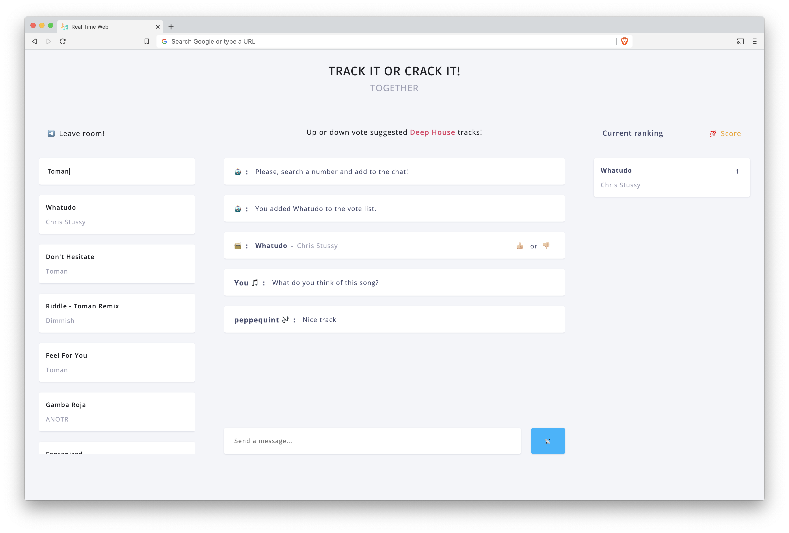

<div align="center">
	<h1 align='center'>Real Time Web</h1>
	
</div>
<p align="center">
	<br>
	Up or downvote tracks based on genre with your friends and create a music playlist together.
	<br>
	<a href="https://rtw-start-pq.herokuapp.com/">Live link</a>
</p>
<br>

## Table of contents
- [Install](#install)
- [Wiki](#wiki)
- [Status](#status)
- [Sources](#sources)

***

## Install
This is a Node and Express based application. You must have [Node.js](https://nodejs.org/en/download/) installed on your computer to run this project. To install this project on your computer, please follow the steps below from your command line:

```shell
# Clone repository
git clone https://github.com/peppequint/real-time-web-1920.git

# Go to the repository
cd real-time-web-1920

# Install dependencies
npm install

# Runs build scripts and starts nodemon
npm run dev
```

This project also uses different scripts to speed up the process of developing during the project. In the [`package.json`](https://github.com/peppequint/progressive-web-apps-1920/blob/master/package.json) file you will see the different scripts.

```shell
# Watches live changes JavaScript and CSS
npm run watch
```

To use the application, you need different ID's from the Spotify API. Visit this [link](https://developer.spotify.com/dashboard/login) to setup a new application with your Spotify account.
Create an `.env` file and fill in the credentials in order to run this application. The API is free to use.

***

## API
The [Spotify API](https://developer.spotify.com/) has a lot of feature that can be used. It is a free API when you use it for a non-commercial application. This application makes 2 different calls to the API. 

The first call is to get the Spotify profile of the logged in user (`https://api.spotify.com/v1/me`).

<details>
<summary>
Get Spotify profile
</summary>

``` javascript
{
  country: 'NL',
  display_name: 'Peppe-Quint Boogaard',
  email: 'peppequintb@gmail.com',
  explicit_content: { filter_enabled: false, filter_locked: false },
  external_urls: { spotify: 'https://open.spotify.com/user/peppequint' },
  followers: { href: null, total: 15 },
  href: 'https://api.spotify.com/v1/users/peppequint',
  id: 'peppequint',
  images: [
    {
      height: null,
      url: ...,
      width: null
    }
  ],
  product: 'premium',
  type: 'user',
  uri: 'spotify:user:peppequint'
}
```
</details>

Every time a user presses a key to search for a track, a call is made to the API. This provides real time feedback to the user when he is searching. The API gives back the songs that matches the search request, at a maximum of 20 tracks (`https://api.spotify.com/v1/search?q=${req.query.query}&type=track`).

<details>
<summary>
Get searched songs
</summary>

``` javascript
{
  tracks: {
    href: 'https://api.spotify.com/v1/search?query=T&type=track&offset=0&limit=20',
    items: [
      [Object], [Object], [Object],
      [Object], [Object], [Object],
      [Object], [Object], [Object],
      [Object], [Object], [Object],
      [Object], [Object], [Object],
      [Object], [Object], [Object],
      [Object], [Object]
    ],
    limit: 20,
    next: 'https://api.spotify.com/v1/search?query=T&type=track&offset=20&limit=20',
    offset: 0,
    previous: null,
    total: 100020
  }
}
```
</details>

After the API returns the data that is shown above, the data will be modified to an array of objects. Every object contains the title of the track, the artist of the track and the unique id of the track. Below you'll see an array of tracks when the user presses the key T.

<details>
<summary>
Array of tracks
</summary>

``` javascript
[
  {
    title: 'Toosie Slide',
    artist: 'Drake',
    album: 'Toosie Slide',
    id: '127QTOFJsJQp5LbJbu3A1y'
  },
  {
    title: 'The Box',
    artist: 'Roddy Ricch',
    album: 'Please Excuse Me For Being Antisocial',
    id: '0nbXyq5TXYPCO7pr3N8S4I'
  },
  {
    title: 'Trouble',
    artist: "Chef'Special",
    album: 'Unfold',
    id: '1dEeFAA7955dEhviWfLMqr'
  },
  {
    title: 'The Other Side (from Trolls World Tour)',
    artist: 'SZA',
    album: 'The Other Side (from Trolls World Tour)',
    id: '463PQggkmk5tTw8ug0ahOX'
  },
  {
    title: 'Tranquila',
    artist: 'J Balvin',
    album: 'Old school Regueton Hits',
    id: '5F8t5VIoIIMSOFabiyCX6L'
  },
  ...
]
```
</details>

***

## Data life cycle
In order to clarify the application the data life cycle shows which data is lives where within the application and what the users of the application can change of that data. As you can see, there are some socket events. This events are described in the next section.

<div align="center">
	
</div>
<br>

***

## Events
This application uses [Socket.io](https://socket.io/) to make real time connection between users. There are a several events that are fired when a user does a certain interaction. Below you can read about these events.

#### `join room`

First of all, when a user connects, the username and the room he is currently in are being sent to the server.

``` javascript
// client side 
socket.emit('join room', { username, room });
```

The server checks the username and the room and let the user join that specific connection in order to receive the same messages the other users in that particular room are receiving.

``` javascript
// server side
socket.on('join room', ({ username, room }) => {
	// socket logic for specific room
	...
});
```

Within that function, the logic of chat messages and clicked songs are written to make sure that it will be send to that specific room.

#### `clicked song`
When a user wants to show the song, that he searched for, to other users, he clicks on the song. At that moment it will emit the track to the server with the track name, artist and id of the song.
``` javascript
// client side
results.addEventListener('click', (e) => {
		const track = {
			id: trackId,
			title: trackName,
			artist: trackArtist,
		};
		// sending track to the server
		socket.emit('clicked song', track);
	}
});
```

The selected track is sent to the server. This song should be emitted to all other users currently in that particular room. 

``` javascript
// server side
socket.on('clicked song', (track) => {
	const title = track.title;
	const artist = track.artist;
	const id = track.id;
	const rating = 0;

	// sending to the client
	socket.emit('server message', `You added ${title} to the vote list.`);

	// sending to all the clients in specific room, except the sender
	socket.to(user.room).emit('server message', `${user.username} added ${title} to the vote list.`);

	// sending to all the clients, including the sender
	io.in(user.room).emit('vote message', { title, artist, rating, id });     
});
```

#### `vote message`
The track that a user has chosen, is send to all the client in a specific room, as you can see in the code snippet above.
On the client, this needs to be handle and rendered to the page.
``` javascript
// client side (simplified)
socket.on('vote message', (data) => {
	const li = document.createElement('li');

	const rating = `<span class="ranking__number">${data.rating}</span>`;
	const bot = `<i class="bot__icon">🗳️ :</i>`;

	const vote = `<div class="voting__container"><button id="voting__up" class="voting__btn">👍🏼</button> or <button id="voting__down" class="voting__btn">👎🏼</button></div>`;

	li.classList.add('voting__item');
	li.setAttribute('data-id', data.id);
	li.innerHTML = `${bot}<span class="voting__track">${data.title}</span> - <span class="voting__artist">${data.artist}</span> ${vote}`;

	votingList.append(liVote);
});
```

#### `chat message`
It also possible to chat with other users in a room. When a user fills out the input field on the bottom of the page and submits it, the message will be send to the server.

``` javascript
// client side (simplified)
message.addEventListener('submit', (e) => {
	e.preventDefault();
	// will be send to the server
	socket.emit('chat message', message.value);
	message.value = '';
	return false;
});
```

When the server receives the message, two different messages will be send back to the client. One message that is intended for the user that sends the message and one message for the other users in the room. In this way it is possible to change the styling, like WhatsApp did (the sender gets a green field).

``` javascript
// server side
socket.on('chat message', (message) => {
	socket.emit('user message', `${message}`);
	socket.broadcast.to(user.room).emit('chat message', `${message}`);
});
```

***

## Status
Work in progress! There are a plenty of things that needs to be done in order to make this a finished project.

Things that I wanted to achieve, but didn't succeed: 
- [ ] Voting system via sockets
- [ ] Max of users in a room
- [ ] Adding a database
- [ ] Offline support
- [ ] Create your own room
- [ ] Export playlist to Spotify

***

## Sources
- [Rooms tutorial](https://www.youtube.com/watch?v=jD7FnbI76Hg&t=1543s)
- [Socket.io cheatsheet](https://socket.io/docs/emit-cheatsheet/)

***

## Acknowledgment
Big thanks to [Kris](https://github.com/kriskuiper) for his live tutorial about the Spotify OAuth flow!