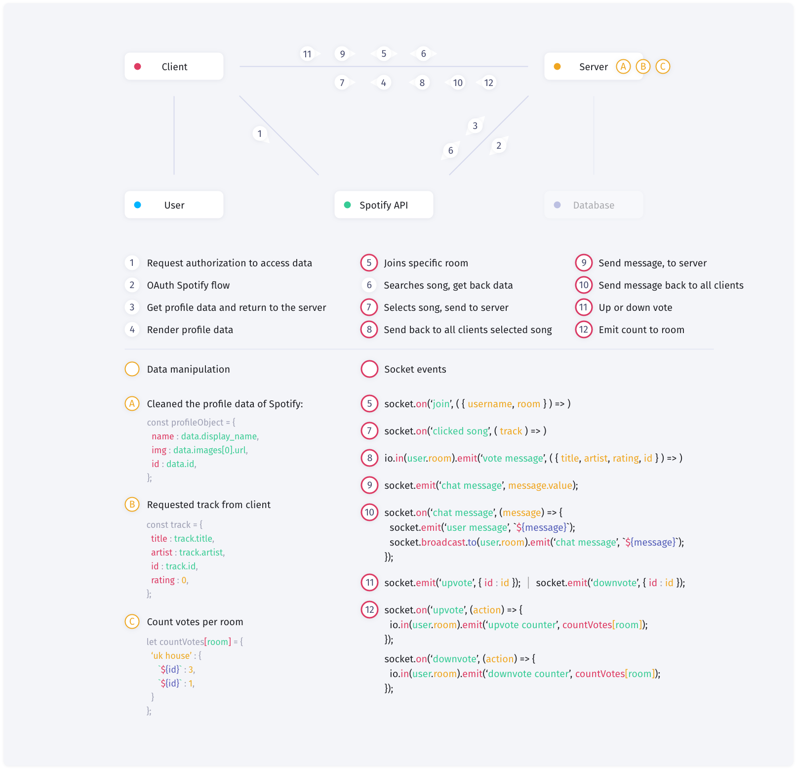

<div align="center">
	<h1 align='center'>Real Time Web</h1>
	<!--  -->
</div>
<p align="center">
	<br>
	Up or downvote tracks with your friends and create a music playlist together.
	<br>
	<!-- <a href="https://rtw-start-pq.herokuapp.com/">Live link</a> -->
</p>
<br>

## Table of contents
- [Install](#install)
- [Wiki](#wiki)
- [Status](#status)
- [Sources](#sources)

## Install
This is a Node and Express based application. You must have [Node.js](https://nodejs.org/en/download/) installed on your computer to run this project. To install this project on your computer, please follow the steps below from your command line:

```shell
# Clone repository
git clone https://github.com/peppequint/real-time-web-1920.git

# Go to the repository
cd real-time-web-1920

# Install dependencies
npm install

# Runs build scripts and starts nodemon
npm run dev
```

This project also uses different scripts to speed up the process of developing during the project. In the [`package.json`](https://github.com/peppequint/progressive-web-apps-1920/blob/master/package.json) file you will see the different scripts.
<!-- 
```shell
# Evokes different build scripts
npm run build

# Watches live changes
npm run watch
``` -->

To use the application, you need different ID's from the Spotify API. Visit this [link](https://developer.spotify.com/dashboard/login) to setup a new application with your Spotify account.
Create an `.env` file an fill in the credentials in order to run this application. The API is free to use.

## API
> Here comes documentation about the Spotify API

## Data life cycle
<div align="center">
	
</div>
<br>


## Status
Work in progress!
- [ ] Search for tracks and push to array
- [ ] Save users that are logged in
- [ ] Create rooms 
- [ ] Setup database

## Sources
- [Rooms Tutorial](https://www.youtube.com/watch?v=jD7FnbI76Hg&t=1543s)

## Acknowledgment
Big thanks to [Kris](https://github.com/kriskuiper) for his live tutorial about the Spotify API!